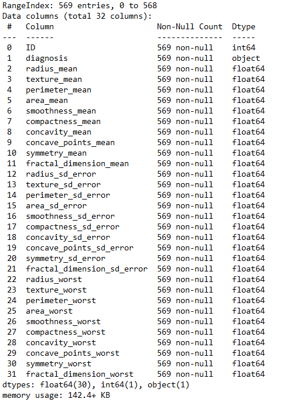
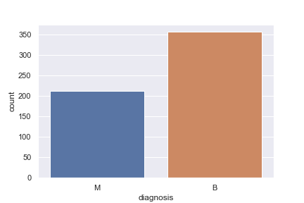
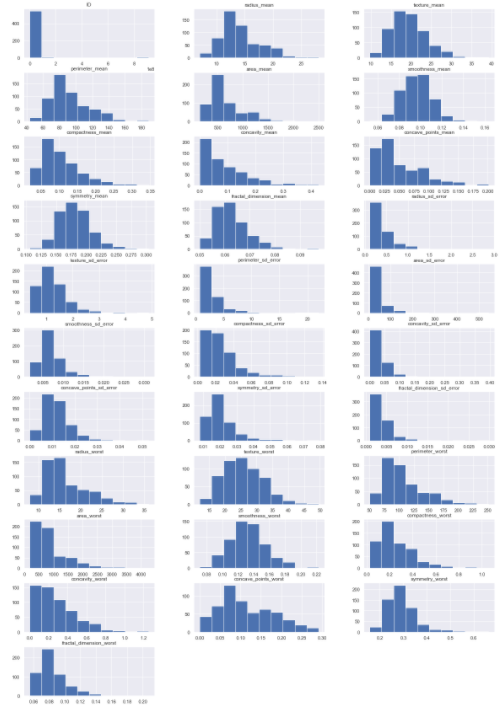
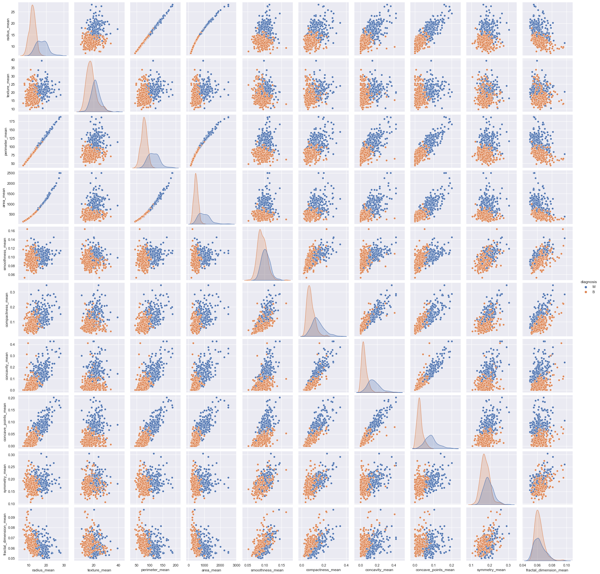
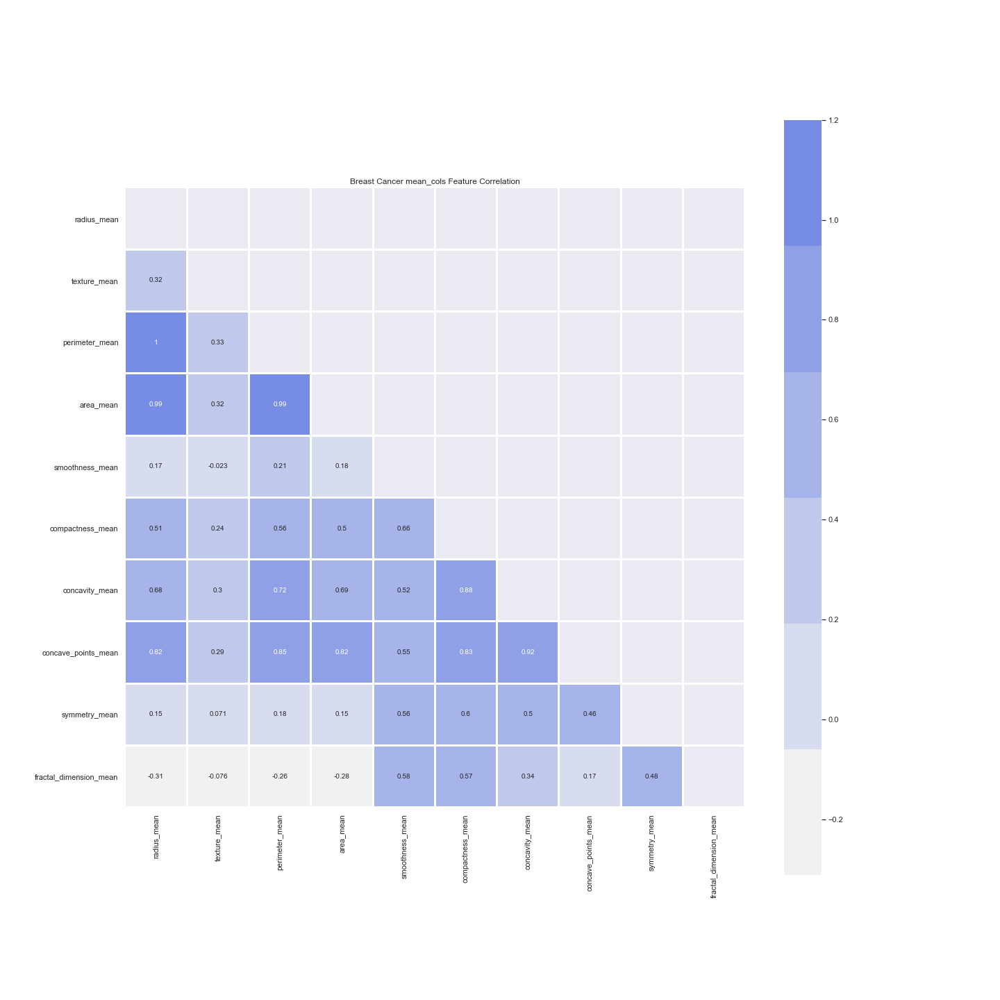
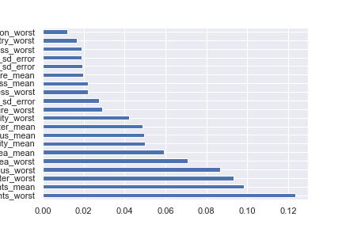
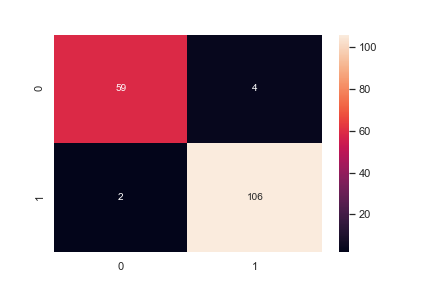

# Advanced-Data-Science-Final-Project

## Breast Cancer

Frist of all the aim is to explore breast cancer dataset. The features of the dataset are computed from a digitized image of a fine needle aspirate (FNA) of a breast mass. They describe characteristics of the cell nuclei present in the image. This data analysis is useful to predict the breast cancer cells in human body.

### Let see what we have in our data set:

<class 'pandas.core.frame.DataFrame'>
RangeIndex: 569 entries, 0 to 568
Data columns (total 32 columns):

So we have 569 records against 32 columns and all of them have 569 non-null records and the data type is float64.

Target columns is the diagnosis

AS seen in chart the Number of Benign is 357 and Number of Malignant is  212.

### Data Exploration

data visualization, we are going to use seaborn plots. Histgram , Scatter , Violin and finaly heatmap plots usually helps us to understand data easily.

As seen the previous plot Now, we know the distribution for each feature on data we can know is a normal distribution or skewness.

As seen the previous plot can know the correlation between features with target column.

As seen the previous plot that example mean_ columns of heatmap That shown extent correlation between features with target column strong or weak.

### Feature Selection and Classification
In this Section, we will use 3 feature selection techniques and will test them with 2 Classifiers.

#### Following Feature Selection Techniques will be used:

1. Feature Importance
2. Principal component analysis (PCA)
3. Feature Selection by using correlation Heatmap

In Classifications, we will use following 2 Techniques to train our model and predict:

1. Random Forest
2. Support Vector Machine
We choose Random Forest because power to handle a large data set with higher dimensionality. for SVM because ususlly use for two classes.

We gone use F1 performance indicator because better measure of the incorrectly classified cases

And use one technique which helps us to prevent Overfitting:

Cross-validation: In standard k-fold cross-validation, we partition the data into k subsets, called folds. Then, we iteratively train the algorithm on k-1 folds while using the remaining fold as the test set (called the “holdout fold”)..

#### Feature Importance
You can get the feature importance of each feature of your dataset by using the feature importance property of the model. Feature importance gives you a score for each feature of your data, the higher the score more important or relevant is the feature towards your output variable. Feature importance is an inbuilt class that comes with Tree Based Classifiers, we will be using Extra Tree Classifier for extracting the top 15 features for the dataset.

Based on Extra Tree/plot that is most 15 importances feature in data.

Random Forsest Accuracy on Test Data: 0.9649122807017544 , F1 : 0.9724770642201834

2-fold cross-validation:
[0.94736842 0.95422535]
The average accuracy of the Random Forest classifier is : 0.95.

